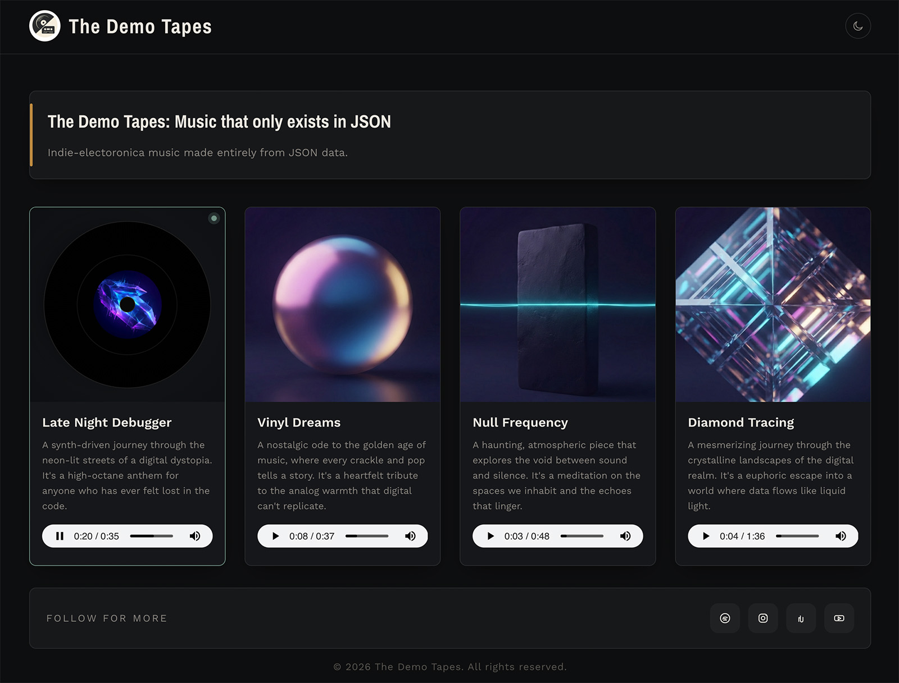

# Vinyl Web Player

A lightweight web audio player built with plain HTML, CSS, and JavaScript. It is designed to feel simple and clean, with a vinyl-inspired animation and no third-party libraries or frameworks.



## Quick Start

1. Clone the repository.
2. Start a local web server:

```bash
python3 -m http.server 8000
```

3. Open the site in your browser:

```text
http://localhost:8000/
```

> The player should be served over HTTP rather than opened directly as a file, otherwise the JSON data may not load correctly.

## Features

- Lightweight HTML, CSS, and JavaScript structure
- Vinyl-style visual animation
- Simple audio playback experience
- No dependencies on third-party libraries or frameworks

## See It in Action

You can view a live example of the project on [Boombamason](https://boombamason.com).

## Project Structure

- `index.htm` - Main page markup and content
- `style.css` - Styling and visual presentation
- `script.js` - Player behaviour and interaction logic
- `songs.json` - Track metadata, image paths, and audio paths
- `assets/` - Cover art, audio files, and other media

## Customising Content

To adapt the player for your own music or branding, update the following:

- `index.htm` - Page title, description, and visible text
- `songs.json` - Track titles, descriptions, cover images, and audio file paths
- `assets/covers/` - Cover art images for each song
- `assets/audio/` - MP3 audio files for each song
- `assets/images/` - Logos or other supporting images

Each track entry in `songs.json` should point to the correct image and audio files, for example:

```json
{
  "title": "Song Title",
  "description": "Short description",
  "image": "assets/covers/track-01.jpg",
  "mp3": "assets/audio/track-01.mp3"
}
```

## Running Locally

This project is a static site, so it can be hosted almost anywhere without a backend. No PHP, Python, ASP, Java, Node.js, or other server-side runtime is required.

A simple local server is enough for testing:

```bash
python3 -m http.server 8000
```

Then visit:

```text
http://localhost:8000/
```

## Deploying to GitHub or a Web Host

When publishing the project:

- Upload all project files, including `songs.json`, `assets/`, `index.htm`, `style.css`, and `script.js`
- Make sure the audio and image files are uploaded with the correct relative paths
- If your host serves files from a public directory, place the project contents there
- Confirm that the host serves `.mp3` files correctly

## File Permissions

If you upload the site to a server, ensure the files are readable by the web server:

- HTML, CSS, JavaScript, JSON, image, and audio files should be readable
- On some shared hosts, permissions such as `644` for files and `755` for folders may be required

## Contributing

Contributions are welcome. If you would like to improve the project, please fork the repository, create a branch, and open a pull request with your changes.

## License

MIT
